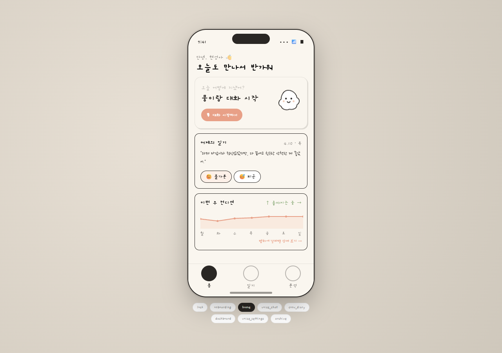
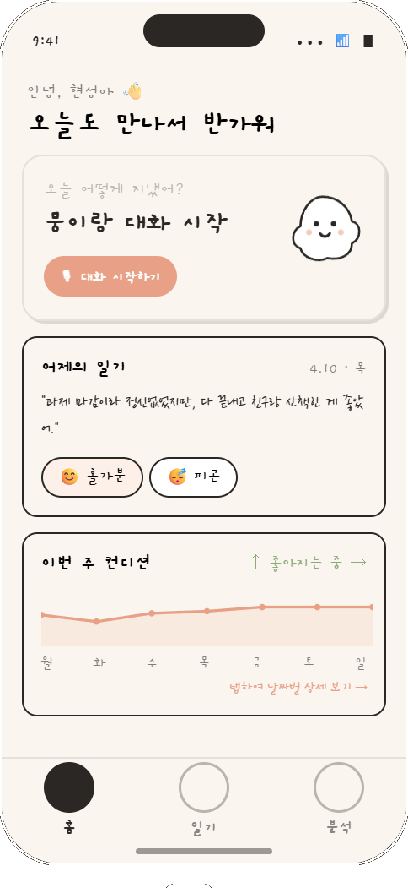
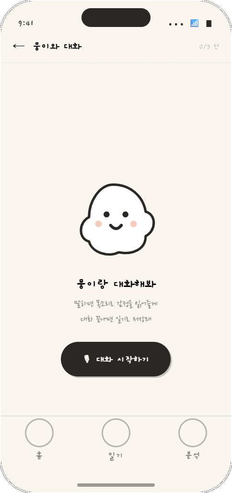
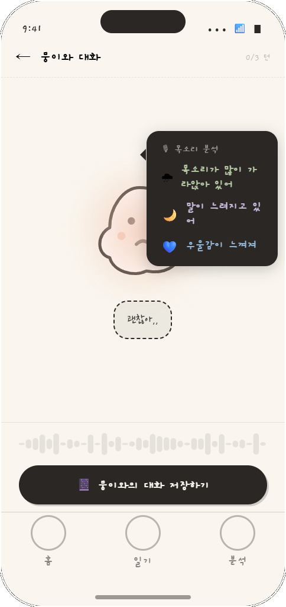
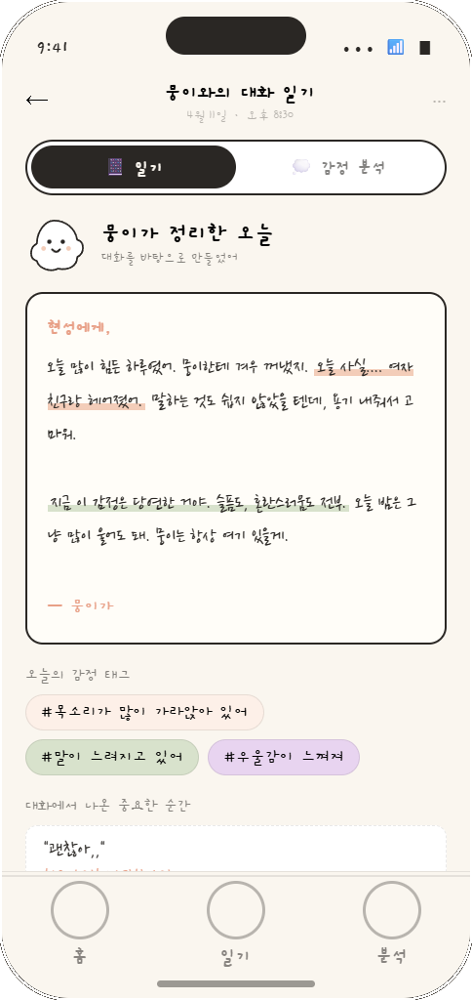
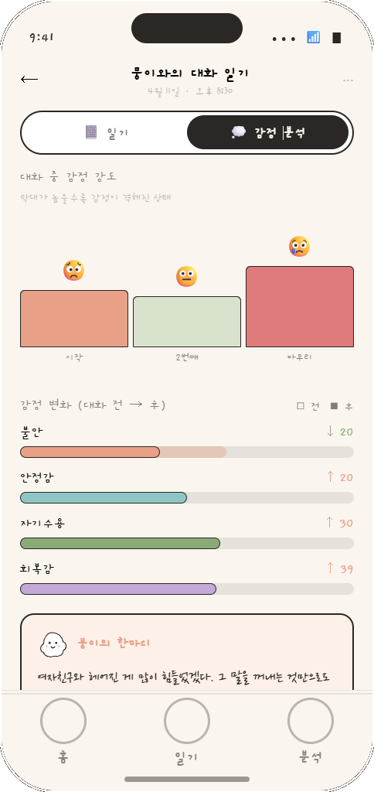
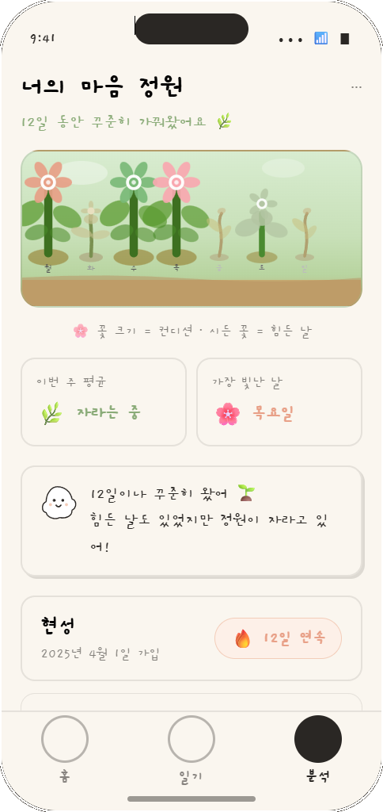
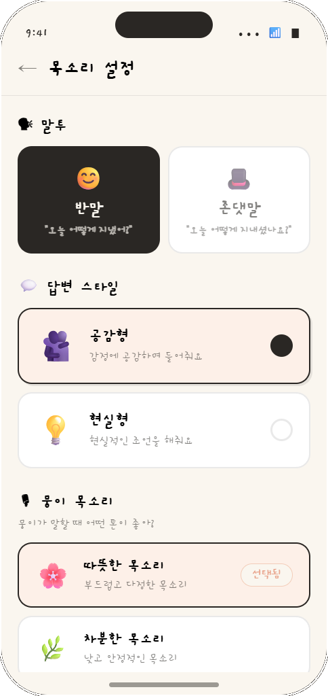
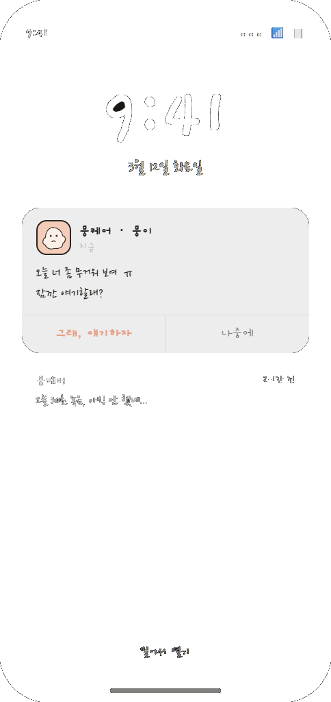

<div align="center">



# 🌿 뭉케어 (Moong Care)

### 말의 내용이 아니라, **목소리의 맥락**을 듣는 AI

**음성 바이오마커 기반 감정 케어 서비스**

[](https://stately-pika-5fe740.netlify.app/)
[](https://stately-pika-5fe740.netlify.app/)
[](LICENSE)
[](https://react.dev)

---

### 🏆 제3회 COSS 스타트업 경진대회 **대상 수상**
바이오헬스 혁신융합대학 × 실감미디어 혁신융합대학 (2025.05.23~24)

</div>

---

## 💬 "지금 우리가 쓰는 AI 상담, 정말 감정을 이해하고 있을까요?"

ChatGPT 주간 사용자 8억 명. 18~21세 청년 5명 중 1명이 힘들 때 AI에게 조언을 구합니다.  
하지만 결정적인 한계가 있습니다.

> 지친 목소리로 **"아… 괜찮아"** 라고 말해도,  
> AI에 저장되는 건 단 세 글자 **"괜찮아"**.  
> 감정의 맥락이 사라지니, 정말 필요한 답을 줄 수 없습니다.

---

## 📱 스크린샷

<div align="center">
<table>
  <tr>
    <td align="center"><br/><b>홈탭</b></td>
    <td align="center"><br/><b>대화 시작</b></td>
    <td align="center"><br/><b>음성 분석</b></td>
    <td align="center"><br/><b>SER 말풍선</b></td>
  </tr>
  <tr>
    <td align="center"><br/><b>일기 정리</b></td>
    <td align="center"><br/><b>감정 변화</b></td>
    <td align="center"><br/><b>꽃 출석표</b></td>
    <td align="center"><br/><b>목소리 설정</b></td>
  </tr>
</table>
</div>

---

## 🔍 Problem

### AI는 '텍스트'만 듣는다

메라비언 법칙에 따르면 감정 전달은 **말 7%, 목소리 톤 38%, 표정 55%** 로 이뤄집니다.  
STT(음성→텍스트) 기반 AI가 듣는 건 단 **7%**.  
목소리 톤 **38%를 통째로 놓치는** 것입니다.

---

## ✨ Solution

### 음성 바이오마커로 목소리의 맥락까지 읽습니다

| 기능 | 설명 |
|------|------|
| 🎙️ **목소리 떨림 분석** | 피치·에너지·리듬을 추출해 감정 맥락 파악 |
| 📊 **어제의 나와 비교** | 개인 베이스라인 대비 변화량으로 감정 감지 |
| 🌿 **커스터마이징** | 말투·답변 스타일·목소리를 내가 직접 선택 |
| 📔 **감정 일기 자동 생성** | 대화가 끝나면 오늘 하루를 일기로 정리 |
| 🌸 **꽃 출석표** | 매일의 기록을 시각화해 리텐션 형성 |

---

## 🛠 Tech Stack

```
Frontend    React 18 (Babel in-browser, no build step)
Audio       Web Audio API / MediaRecorder
TTS         Web Speech API (SpeechSynthesis)
SER         Speech Emotion Recognition (librosa, F0·RMS·리듬 피처)
LLM         GPT-4o (감정 맥락 반영 응답 생성)
Serving     npx serve (정적 파일)
```

---

## 🚀 Getting Started

```bash
# 1. 레포 클론
git clone https://github.com/hyun-sai/Moong-Care.git
cd Moong-Care

# 2. 서버 실행 (Node.js 필요)
npx serve --listen 5175

# 3. 브라우저에서 열기
open http://localhost:5175
```

---

## 🎬 Demo Flow

1. **홈탭**에서 "오늘 어땠어?" 한마디로 녹음 시작
2. **뭉이**가 현실형·반말 모드로 대화를 이어감
3. 대화 중 실시간으로 **SER 말풍선**이 목소리 감정 분석 표시
4. 대화 종료 후 **음성 분석 리포트** (말속도·발화량·에너지)
5. 오늘 하루를 **감정 일기**로 자동 정리
6. **어제 vs 오늘** 감정 변화 비교
7. **꽃 출석표**로 매일의 기록 시각화

---

## 📂 Project Structure

```
Moong-Care/
├── index.html          # 진입점
├── app.jsx             # 라우팅 & 전체 레이아웃
├── voice.jsx           # 음성 대화 + SER 말풍선 (핵심)
├── screens.jsx         # 감정 일기 / 분석 화면
├── kit.jsx             # 디자인 시스템 (컬러, 컴포넌트)
├── screenshots/        # 앱 스크린샷 (1-1.png ~ 8-8.png)
├── user1.m4a           # 데모 음성 1
├── user2.m4a           # 데모 음성 2
├── user3.m4a           # 데모 음성 3
└── user4.m4a           # 데모 음성 4
```

---

## 👥 Team

> **3개 활동으로 다져진 역량 — 뭉케어를 만들 수 있음을 증명합니다**

- 🖥️ **3년차 개발 팀워크** — 전원 컴퓨터과학 학부에서 3년간 함께 프로젝트 수행
- 🚀 **균형 잡힌 인재 구성** — 협력형·친화형·리더십형·창조형 강점 조화
- 🏆 **실전 운영·검증** — 게임 전략 분석 사이트 사업자 등록 운영, 287명 사용자 확보

<br>

<div align="center">
  <table>
    <tr>
      <td align="center">
        <a href="https://github.com/leegoeun-art">
          <br/>
          <b>이고은</b><br/>
          <sub>👑 팀장</sub><br/>
          <sub>@leegoeun-art</sub>
        </a>
      </td>
      <td align="center">
        <a href="https://github.com/hyun-sai">
          <br/>
          <b>최현성</b><br/>
          <sub>🛠️ 팀원</sub><br/>
          <sub>@hyun-sai</sub>
        </a>
      </td>
      <td align="center">
        <a href="https://github.com/LeeGJin">
          <br/>
          <b>이경진</b><br/>
          <sub>🛠️ 팀원</sub><br/>
          <sub>@LeeGJin</sub>
        </a>
      </td>
      <td align="center">
        <a href="https://github.com/somgam6373">
          <br/>
          <b>이준혁</b><br/>
          <sub>🛠️ 팀원</sub><br/>
          <sub>@somgam6373</sub>
        </a>
      </td>
    </tr>
  </table>
</div>

---

## 💡 Positioning

```
         무거움 ◄────────────────────► 가벼움
              │                           │
         전문 상담                    음성 일기장
         (진입장벽 높음)              (반응 없음)
                        │
                   [ 뭉케어 ]
              가볍지만 살아있는 대화
```

---

<div align="center">

**말이 아니라 목소리를 듣고, 모든 사람의 마음을 아우르는 AI**

🌿 *뭉케어 — Moong Care*

</div>
